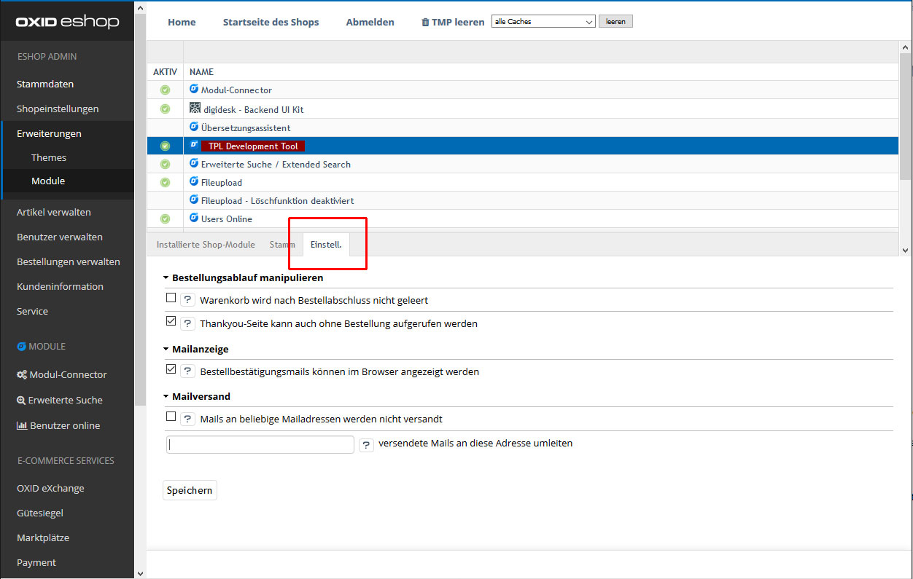

# TPL Development Helper
### Entwicklungswerkzeug zur Kontrolle schwer zugänglicher Shopinhalte

Diese Tool soll bei täglichen Entwicklungsaufgaben im OXID eShop helfen, die (systembedingt) vom Shopsystem erschwert werden.

* Mailversand (übers Shopframework) übers Shopframework wird blockiert __oder__
* Mails (übers Shopframework) werden an alternative Mailadresse umgeleitet
    (Das Tool setzt direkt an der oxemail::_sendMail()-Methode an und kann damit __jeden__ Mailversand kontrollieren, der übers Framework läuft. Man muss nicht X verschiedene Module überwachen und hat auch Kontrolle über Mailerweiterungen, die keinen Stage-Einsatz vorsehen.)
* unterbindet das Löschen des Warenkorbs nach Bestellabschluss
* Thankyou-Seite ist auch ohne Bestellabschluss aufrufbar (unter Angabe der Bestellnummer auch für eine bestimmte Bestellung)
* Bestellbestätigungsmails und sind im Browser darstellbar (unter Angabe der Bestellnummer auch für eine bestimmte Bestellung)

__Da hiermit gezielt Mails der Shopbestellungen angezeigt werden können, ist das Modul mit äußerster Vorsicht zu verwenden. Die Hürden für die Anzeige der Mails sind daher absichtlich sehr hoch gesetzt. Vor der Verwendung sind Einstellungen zu ändern. Denken Sie unbedingt daran, diese Einstellungen im Anschluss wieder zurückzusetzen. Sonst sind Kunden- und Bestelldaten frei abrufbar. Wir übernehmen für daraus resultierenden Schäden keine Haftung.__

Um unser Tool verwenden zu können, folgen Sie bitte diesen Schritten:

1. Produktivmodus entfernen

   

2. Modul aktivieren

   
   
3. In den Einstellungen die gewünschten Funktionen freischalten

   
   
4. Über die Links im Tab „Stamm“ können Sie die betreffenden Seiten aufrufen. Vor der Darstellung wird ein Benutzername und Passwort abgefragt. Hierfür verwenden Sie die Anmeldedaten des Abminbereichs Ihres Shops.

5. An den E-Mail- und Thankyou-Links gibt es einen leeren Parameter, den Sie bei Bedarf mit einer Bestellnummer füllen können. Dann wird statt der letzten Bestellung ganz gezielt eine andere Bestellung zur Darstellung verwendet.

6. Beachten Sie unbedingt, dass Sie nach der Verwendung unbedingt das Modul wieder deaktivieren und den Produktivmodus wieder anschalten.

Berücksichtigen Sie bei der Darstellung der E-Mails bitte, dass die Mailprogramme diese möglicherweise anders darstellen, als der Browser dies tut. Daher kann die Darstellung im Browser nur ein Anhaltspunkt sein.